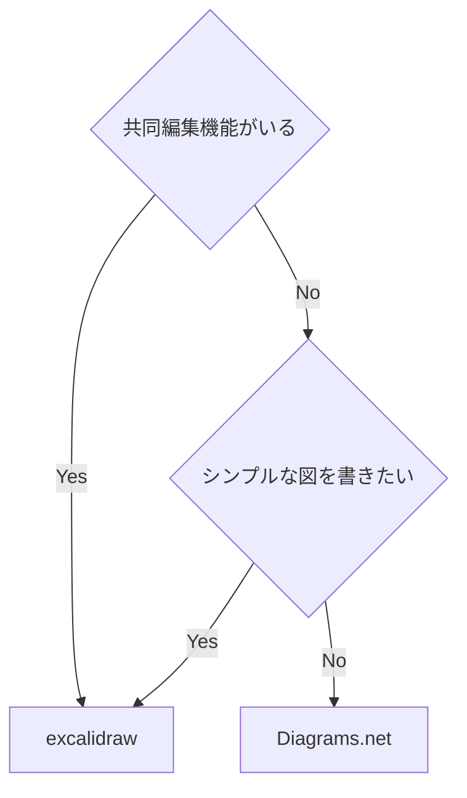

- [diagrams.net](https://www.drawio.com) (旧 draw.io)
  - [GitHub](https://github.com/jgraph/drawio)
  - 良い点:
    - Extras -> Mathematical Typesetting を有効化することで、数式も書ける
      - \$\$じゃなくて、\`\`でくくることで数式になる
    - [VSCode 拡張機能](https://github.com/hediet/vscode-drawio)が滅茶苦茶優秀
      - `*.drawio.svg`と書くと、svg 形式で保存される (.png で png 形式になる)
      - svg 形式で保存すると、github で差分が見れるのですごく良い
  - 悪い点:
    - excalidraw に比べると、UI が少し分かりずらい
    - obsidian で使うときに、メンテされてる拡張機能がない
- [excalidraw.com](https://excalidraw.com)
  - [GitHub](https://github.com/excalidraw/excalidraw)
  - 良い点:
    - リアルタイム共同編集可能
      - iPad と PC で同時に編集とかもできる
      - URL 発行するだけで出来て簡単
    - UI がシンプルで分かりやすい
    - 手書き風の見た目が売りっぽい
    - iPad で PWA としてインストールすれば、手書きアプリっぽくも使える。
    - obsidian で一番有名な拡張機能がある。
  - 悪い点:
    - 数式機能がまだプレビュー版でしか使えない([2023-05-04](2023-05-04))
      - ちなみに次のサイトで使えるようになってる ([Issue](https://github.com/excalidraw/excalidraw/issues/5265))
      - https://math.preview.excalidraw.com
    - 複雑な図を書くのは難しそう
      - シンプルさを最優先してるからしょうがない
      - この点では、diagrams.net のほうが強そう

## まとめ

