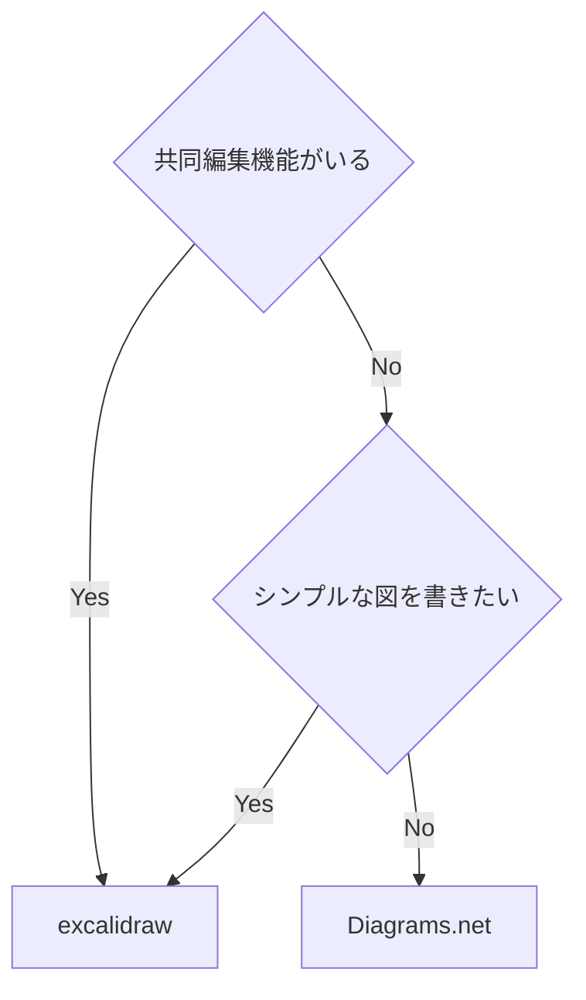

- [diagrams.net](https://www.drawio.com) (旧draw.io)
	- [GitHub](https://github.com/jgraph/drawio)
	- 良い点:
		- Extras -> Mathematical Typesetting を有効化することで、数式も書ける
			- \$\$じゃなくて、\`\`でくくることで数式になる
		- [VSCode拡張機能](https://github.com/hediet/vscode-drawio)が滅茶苦茶優秀
			- `*.drawio.svg`と書くと、svg形式で保存される (.pngでpng形式になる)
			- svg形式で保存すると、githubで差分が見れるのですごく良い
	- 悪い点:
		- excalidrawに比べると、UIが少し分かりずらい
		- obsidianで使うときに、メンテされてる拡張機能がない
- [excalidraw.com](https://excalidraw.com)
	- [GitHub](https://github.com/excalidraw/excalidraw)
	- 良い点:
		- リアルタイム共同編集可能
			- iPadとPCで同時に編集とかもできる
			- URL発行するだけで出来て簡単
		- UIがシンプルで分かりやすい
		- 手書き風の見た目が売りっぽい
		- iPadでPWAとしてインストールすれば、手書きアプリっぽくも使える。
		- obsidianで一番有名な拡張機能がある。
	- 悪い点:
		- 数式機能がまだプレビュー版でしか使えない([2023-05-04](2023-05-04))
			- ちなみに次のサイトで使えるようになってる ([Issue](https://github.com/excalidraw/excalidraw/issues/5265))
			- https://math.preview.excalidraw.com
		- 複雑な図を書くのは難しそう
			- シンプルさを最優先してるからしょうがない
			- この点では、diagrams.netのほうが強そう

## まとめ

